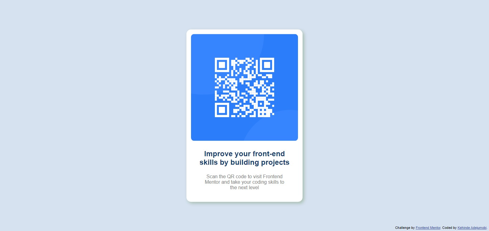

## Overview

### Screenshot



### Links

- Solution URL: [https://github.com/Perception12/qr-code-component](https://github.com/Perception12/qr-code-component)
- Live Site URL: [https://perception12.github.io/qr-code-component/](https://perception12.github.io/qr-code-component/)

## My process

### Built with

- Semantic HTML5 markup
- CSS custom properties For styles

### What I learned

I learned how to center a div using absolute position and transform properties

To see how you can add code snippets, see below:

```html
<div class="box">
    
    <p class="title">Improve your front-end skills by building projects</p>
    <p class="description">Scan the QR code to visit Frontend Mentor and take your coding skills to the next level</p>
</div>
```

```css
.box {
    position: absolute;              
    top: 50%;
    left: 50%;                        
    transform: translate(-50%, -50%); 
}
```
